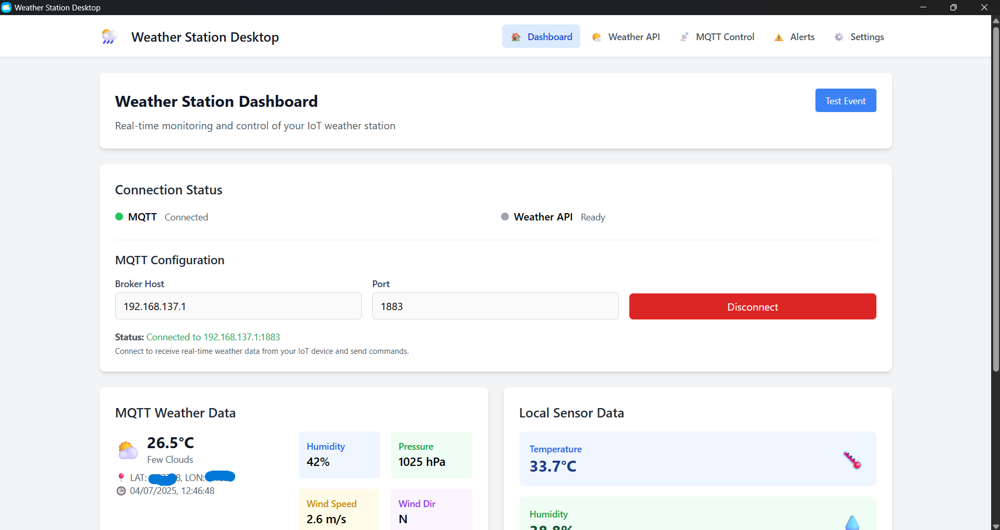
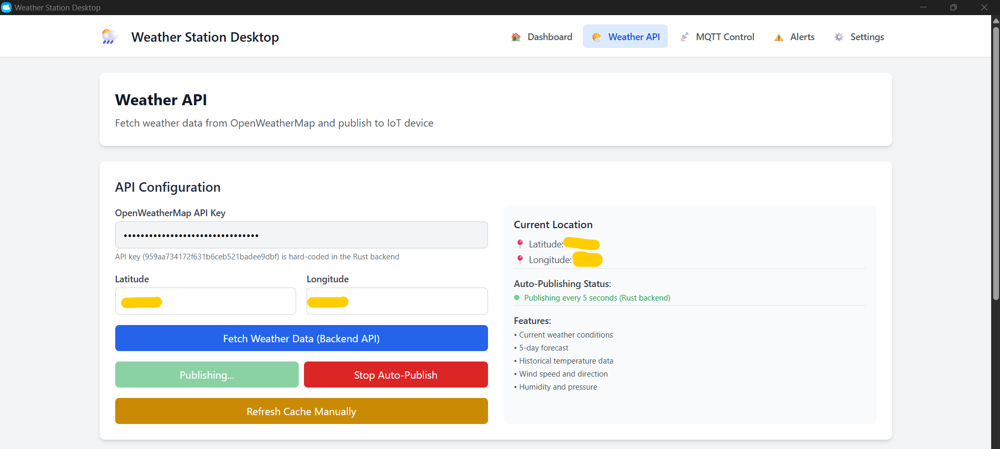
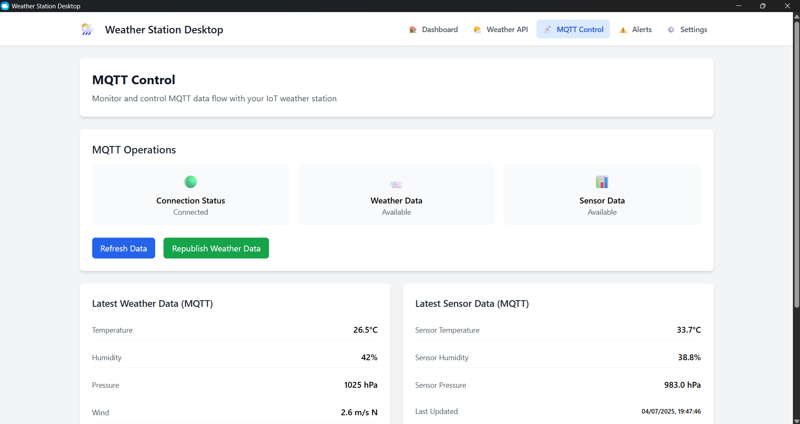
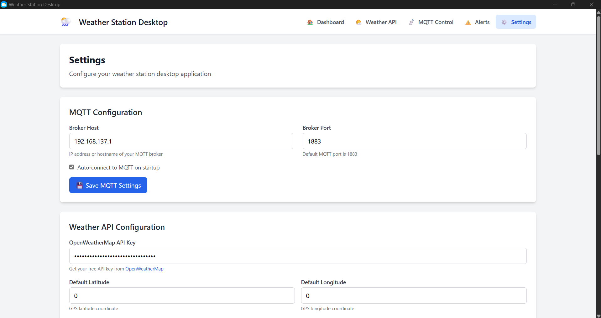
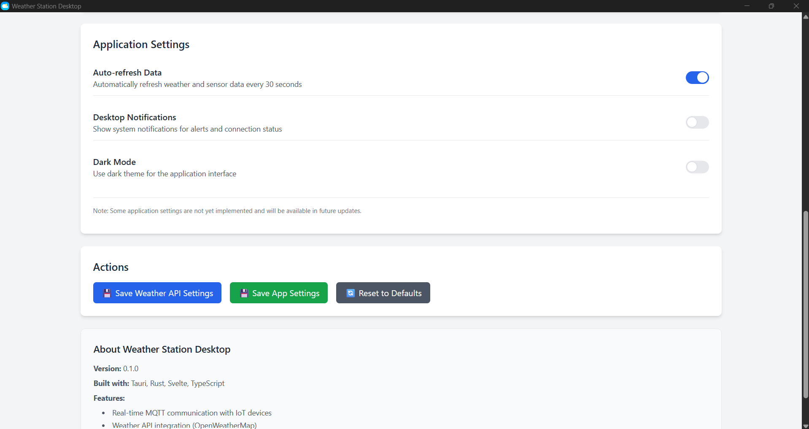
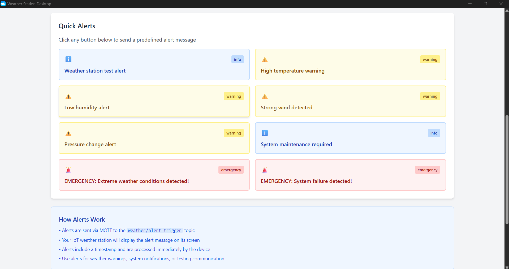
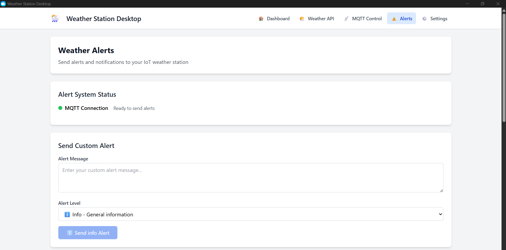

# Weather Station Desktop

A modern desktop application for managing and monitoring your IoT weather station, built with Tauri, Rust, and Svelte.

## Features

- **Real-time MQTT Communication**: Connect to your IoT weather station via MQTT
- **Weather API Integration**: Fetch weather data from OpenWeatherMap API
- **Cross-platform Desktop App**: Built with Tauri for Windows, macOS, and Linux
- **Modern UI**: Clean, responsive interface built with Svelte and Tailwind CSS
- **Alert System**: Send alerts and notifications to your weather station
- **Data Visualization**: View current conditions, forecasts, and sensor data

## Screenshots

### Dashboard

*Main dashboard showing weather station status and sensor data*

### Weather API

*Weather API configuration and data fetching interface*

### MQTT Control

*MQTT connection monitoring and control panel*

### Settings

*General settings and MQTT configuration*


*Weather API settings and location configuration*

### Alerts

*Quick alert sending interface*


*Custom alert configuration panel*

## Architecture

### Backend (Rust)
- **MQTT Client**: Handles real-time communication with IoT devices using `rumqttc`
- **Weather API**: Fetches weather data from OpenWeatherMap using `reqwest`
- **Data Processing**: Manages weather data, sensor readings, and alerts
- **Tauri Commands**: Exposes backend functionality to the frontend

### Frontend (Svelte)
- **Dashboard**: Overview of weather station status and data
- **Weather API**: Interface for fetching weather data from external APIs
- **MQTT Control**: Monitor and control MQTT communication
- **Alerts**: Send notifications to the weather station
- **Settings**: Configure MQTT and API settings

## Getting Started

### Prerequisites

- Node.js (v18 or later)
- Rust (latest stable)
- OpenWeatherMap API key (free tier available)

### Installation

1. Clone the repository:
```bash
git clone <repository-url>
cd weather-station-desktop
```

2. Install dependencies:
```bash
npm install
```

3. Install Rust dependencies:
```bash
cd src-tauri
cargo build
cd ..
```

4. Run in development mode:
```bash
npm run tauri:dev
```

### Building for Production

Build the application for your platform:
```bash
npm run tauri:build
```

This will create platform-specific binaries in `src-tauri/target/release/bundle/`.

## Configuration

### MQTT Settings
- **Broker Host**: IP address of your MQTT broker (default: 192.168.137.1)
- **Broker Port**: MQTT broker port (default: 1883)

### Weather API Settings
- **API Key**: Your OpenWeatherMap API key
- **Latitude/Longitude**: GPS coordinates for weather data

### MQTT Topics

The application uses the following MQTT topics:

- `weather/data` - Weather information from API
- `weather/sensor_data` - Local sensor readings from IoT device
- `weather/alert_trigger` - Weather alerts and notifications
- `weather/data_request` - Request latest data from IoT device

## Development

### Project Structure

```
weather-station-desktop/
├── src/                    # Svelte frontend
│   ├── lib/               # Shared components and utilities
│   ├── routes/            # Page components
│   └── app.html           # HTML template
├── src-tauri/             # Rust backend
│   ├── src/               # Rust source code
│   ├── Cargo.toml         # Rust dependencies
│   └── tauri.conf.json    # Tauri configuration
├── static/                # Static assets
├── package.json           # Node.js dependencies
└── vite.config.ts         # Vite configuration
```

### Available Scripts

- `npm run dev` - Start Vite development server
- `npm run build` - Build frontend for production
- `npm run preview` - Preview production build
- `npm run tauri:dev` - Run Tauri in development mode
- `npm run tauri:build` - Build Tauri application

### Adding New Features

1. **Backend (Rust)**: Add new Tauri commands in `src-tauri/src/main.rs`
2. **Frontend (Svelte)**: Create new components in `src/lib/` or new pages in `src/routes/`
3. **Types**: Update TypeScript interfaces in `src/lib/tauri.ts`

## IoT Device Integration

This desktop application is designed to work with M5Stack-based weather stations. The corresponding IoT device code should:

1. Connect to the same MQTT broker
2. Subscribe to `weather/data` and `weather/alert_trigger` topics
3. Publish sensor data to `weather/sensor_data` topic
4. Respond to data requests on `weather/data_request` topic

## Troubleshooting

### MQTT Connection Issues
- Verify MQTT broker is running and accessible
- Check firewall settings
- Ensure correct IP address and port
- Test with MQTT client tools (e.g., mosquitto_pub/sub)

### Weather API Issues
- Verify API key is correct and active
- Check API usage limits
- Ensure internet connectivity
- Validate GPS coordinates

### Build Issues
- Update Rust toolchain: `rustup update`
- Clear cache: `cargo clean` and `npm run clean`
- Verify all dependencies are installed

## License

MIT License - see LICENSE file for details.

## Contributing

1. Fork the repository
2. Create a feature branch
3. Make your changes
4. Add tests if applicable
5. Submit a pull request

## Support

For issues and questions, please create an issue in the repository or contact the development team.